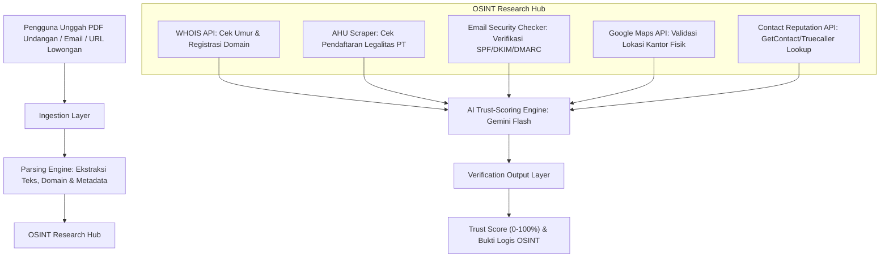

# Proposal & Arsitektur Sistem: "JobTrust" — Platform Verifikasi Lowongan Kerja & Deteksi Fraud berbasis OSINT & AI (Gemini Flash)

Dokumen ini berisi rancangan lengkap, arsitektur sistem, dan rencana riset teknologi untuk platform **JobTrust** (verifikator keaslian lowongan pekerjaan dan identitas perusahaan penerbit). Dokumen ini dibedah menggunakan **Sistem CCA + Step 0** sesuai dengan pedoman riset [framework-problem-solver.md](file:///Users/matthewpriantara/Documents/Code/competition_project/gemastik26/gemastik19/riset/strategi/framework-problem-solver.md).

---

## 1. Analisis Kelayakan & Relevansi OSINT

Menggunakan **OSINT (Open Source Intelligence)** untuk memverifikasi keaslian lowongan kerja dan perusahaan sangat **sangat memungkinkan, relevan, dan efisien**. 

### Mengapa OSINT Sangat Efektif untuk Kasus Ini?
Penipuan lowongan kerja (*job scam*) di Indonesia umumnya memiliki pola digital footprint yang konsisten dan bisa dideteksi secara publik:
1.  **Penggunaan Domain Palsu/Baru:** Penipu sering membuat situs tiruan (misal `recruitment-pertamina-tbk.com` padahal domain resmi `pertamina.com`) yang baru didaftarkan beberapa hari/minggu lalu. WHOIS OSINT dapat mendeteksi tanggal registrasi domain ini.
2.  **Identitas Perusahaan Fiktif:** Penipu sering mencatut nama PT yang tidak terdaftar di database Kemenkumham atau menggunakan alamat kantor fiktif (rumah kosong, lahan kosong) yang dapat diverifikasi via koordinat GPS.
3.  **Modus Penipuan Tiket Travel:** Korban diminta mentransfer uang ke agen travel tertentu untuk akomodasi wawancara palsu. Nomor rekening atau nomor WhatsApp penipu sering kali memiliki reputasi buruk di aplikasi GetContact/Truecaller.

---

## 2. Pemilihan Model AI (Token Banyak & Biaya Rendah)

Untuk platform ini, model terbaik yang direkomendasikan adalah **Google Gemini 1.5 Flash** atau **Gemini 2.5 Flash** (melalui Google AI Studio API).

### Analisis Keunggulan Gemini Flash:
*   **Context Window Raksasa (1 Juta - 2 Juta Token):** Sangat krusial karena analisis OSINT membutuhkan input data yang sangat besar secara bersamaan: dokumen PDF undangan wawancara lengkap, tangkapan layar chat korban, metadata email mentah (headers), database registrasi AHU, data pencarian WHOIS, dan data geolokasi Google Maps. Gemini Flash mampu menampung semua data referensi ini dalam sekali inferensi.
*   **Biaya Sangat Murah:** Model kelas Flash memiliki harga API paling ekonomis di industri (sepersekian dari model Pro/Ultra atau model kompetitor seperti GPT-4o).
*   **Context Caching:** Fitur ini memangkas biaya input API hingga 90% untuk query berulang yang menggunakan instruksi sistem (*system prompt*) atau database perusahaan terdaftar yang sama.
*   **Kecepatan Tinggi (Low Latency):** Memungkinkan platform memberikan hasil analisis secara instan kepada pengguna.

---

## 3. Bedah Ide Menggunakan Sistem CCA + Step 0

### A. STEP 0: Challenge the Goal (Dekonstruksi Tujuan)
*   *Tujuan Swasta/Umum:* Membuat database manual berisi daftar lowongan kerja palsu (tidak efektif karena lowongan palsu berganti nama dan disebarkan dalam hitungan jam).
*   *Tujuan Akhir Sebenarnya:* Memberikan **verifikasi keaslian seketika (*real-time trust validation*)** dari suatu penawaran kerja langsung di tangan pengguna sebelum mereka menjadi korban penipuan uang/data pribadi.
*   *Radical Shortcut:* Alih-alih melacak satu per satu postingan, sistem memproses **dokumen undangan/tawaran kerja yang diunggah pengguna** dan melakukan investigasi OSINT otomatis secara terarah (*on-demand verification*).

### B. CERDAS (First-Principles Thinking)
*   *Variabel Fundamental Kepercayaan Perusahaan:* 
    *   **Legalitas:** Terdaftar di Ditjen AHU Kemenkumham.
    *   **Komunikasi:** Menggunakan email dengan domain resmi perusahaan (lulus verifikasi SPF/DKIM/DMARC) bukan email gratisan atau domain palsu.
    *   **Fisik:** Alamat kantor sesuai dengan koordinat koordinat bisnis resmi.
*   *Kausalitas Fraud:* Jika domain email baru berumur < 30 hari, nama PT tidak ditemukan di AHU, dan nomor kontak pengirim ditandai sebagai "Scam/Penipu" di GetContact, maka probabilitas kebohongan (*fraud probability*) secara matematis mendekati 99.9%.

### C. CERAH (Peta Realitas Taktis)
*   Menghindari integrasi API berbayar mahal di tahap awal (seperti API GetContact Enterprise). Tim dapat membuat *web scraper* berlatar belakang antrean (Queue) yang melakukan query ke situs direktori publik, WHOIS gratis, database AHU publik, dan pencarian Google Maps untuk menghemat biaya operasional prototipe.

### D. ASIK (Integritas sebagai Multiplier untuk Kepercayaan Pengguna)
*   Untuk membangun kepercayaan pengguna (*trust* tinggi), platform tidak boleh hanya menampilkan status "ASLI" atau "PALSU" tanpa bukti. Output harus menyajikan **diagram transparansi data bukti** (seperti tanggal domain dibuat, kecocokan koordinat alamat, dan status SPF email) agar pengguna memahami landasan logis dari hasil analisis.

---

## 4. Arsitektur Sistem JobTrust

Berikut adalah arsitektur aliran data sistem dari input pengguna hingga output tingkat kepercayaan:

---

## 5. Rincian Aliran Kerja & Komponen Arsitektur

### 1. Ingestion & Parsing Layer
*   **Input:** File PDF/Gambar undangan wawancara, teks salinan lowongan, alamat email pengirim, atau URL postingan kerja.
*   **Proses:** 
    *   Menggunakan library **PyPDF/OCR** untuk mengekstrak teks undangan wawancara.
    *   Regex parsing untuk mengekstrak domain email pengirim (misal `recruitment@company-xyz.com`), nomor WhatsApp panitia wawancara, nama PT yang diklaim, dan nama hotel/travel akomodasi yang ditunjuk.

### 2. OSINT Research Hub (Investigasi Otomatis)
*   **Domain & WHOIS Checker:** Mengirimkan domain ke server WHOIS untuk mendapatkan tanggal pembuatan domain. Jika umur domain < 90 hari, ini adalah bendera merah (*red flag*) besar.
*   **Legalitas Korporasi (AHU Lookup):** Melakukan pencarian otomatis pada database registrasi badan usaha Kemenkumham untuk memastikan PT/CV tersebut terdaftar secara resmi di Indonesia.
*   **Keamanan Email (SPF/DKIM/DMARC):** Menganalisis header email (jika pengguna menyalin file `.eml`). Memastikan email pengirim bukan merupakan *spoofing* (pemalsuan alamat pengirim) menggunakan protokol keamanan DNS.
*   **Verifikasi Geospasial (Google Maps):** Mengecek alamat kantor yang tertulis di undangan menggunakan Google Maps API. AI akan menganalisis apakah alamat tersebut berupa perkantoran, ruko, atau lahan kosong/pemukiman biasa.

### 3. AI Trust-Scoring Engine (Gemini 1.5/2.5 Flash)
*   **System Prompt Khusus:** Gemini Flash bertindak sebagai detektif forensik penipuan digital.
*   **Alur Analisis AI:**
    1.  Membaca hasil ekstraksi teks undangan (mendeteksi frasa penipuan seperti: *biaya perjalanan diganti/reimburse*, *penunjukan agen travel tunggal*, *gaji fantastis tanpa kualifikasi*).
    2.  Membaca data WHOIS (umur domain email).
    3.  Membaca status legalitas perusahaan.
    4.  Menghitung persentase keyakinan keaslian lowongan (*Trust Score*) secara kuantitatif berdasarkan korelasi data.

### 4. Output Layer & Visualisasi (ASIK)
*   Menghasilkan 3 tingkat status risiko:
    *   🔴 **HIGH RISK / HOAX (0-39%):** Ditemukan kebohongan fatal (misal: PT fiktif, domain baru dibuat, meminta biaya travel).
    *   🟡 **SUSPICIOUS / WASPADA (40-79%):** Perusahaan terdaftar resmi, namun menggunakan email publik (Gmail/Yahoo) atau deskripsi pekerjaan tidak jelas.
    *   🟢 **VERIFIED / AMAN (80-100%):** Perusahaan terdaftar di AHU, domain email terverifikasi SPF/DKIM resmi, dan alamat fisik perkantoran valid.
*   Menyajikan dasbor visual transparan berisi rincian bukti OSINT (WHOIS, AHU, Maps) yang dapat dibaca dengan mudah oleh pengguna awam.

---

## 6. Langkah-Langkah Riset & Implementasi Strategis

Untuk mewujudkan platform ini dengan tingkat akurasi tinggi, tim disarankan melakukan langkah berikut:
1.  **Pengumpulan Dataset Penipuan (Scam Database):** Mengumpulkan minimal 100 contoh surat undangan wawancara palsu yang marak di Indonesia (paling sering bermodus seleksi BUMN/Pertamina/PLN palsu) untuk melatih model klasifikasi teks Gemini.
2.  **Pembuatan Parser Header Email:** Mempelajari ekstraksi SPF/DKIM/DMARC pada file `.eml` guna mendeteksi email tiruan.
3.  **Uji Coba Scraping AHU Kemenkumham:** Menguji keandalan pencarian nama PT pada sistem data korporasi terbuka.
4.  **Desain Skema Kredibilitas Transparan:** Merancang visualisasi laporan keaslian agar pengguna awam tidak bingung dan langsung percaya pada keputusan aplikasi.
