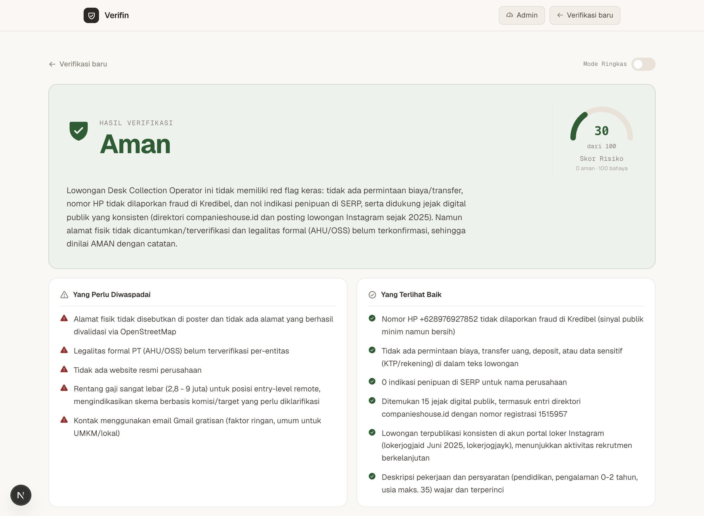
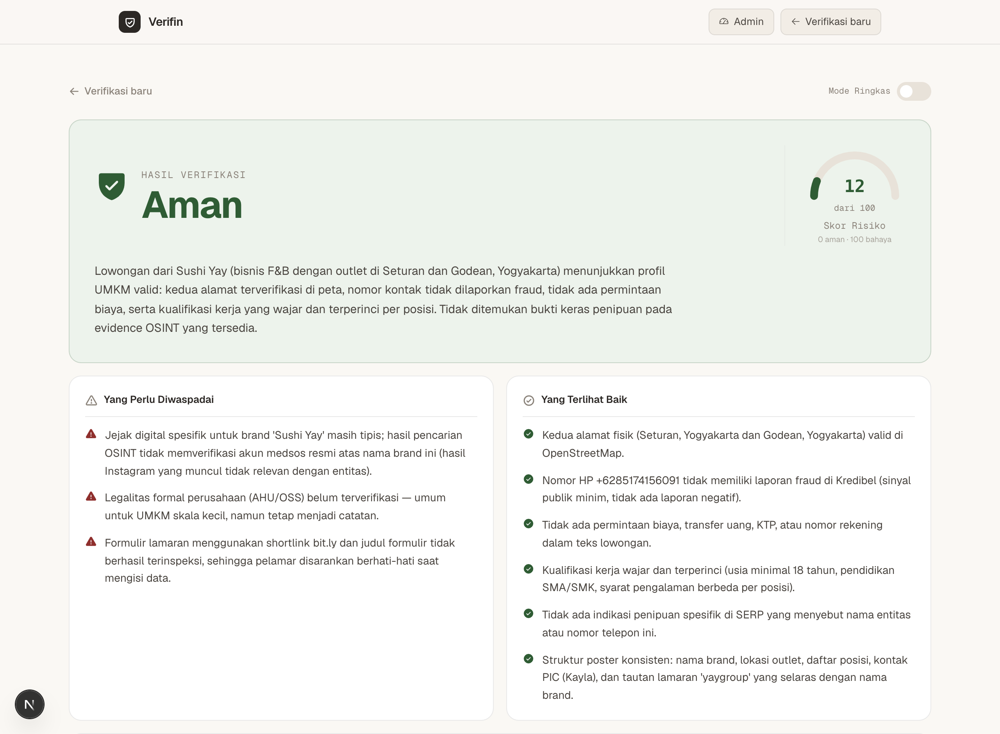
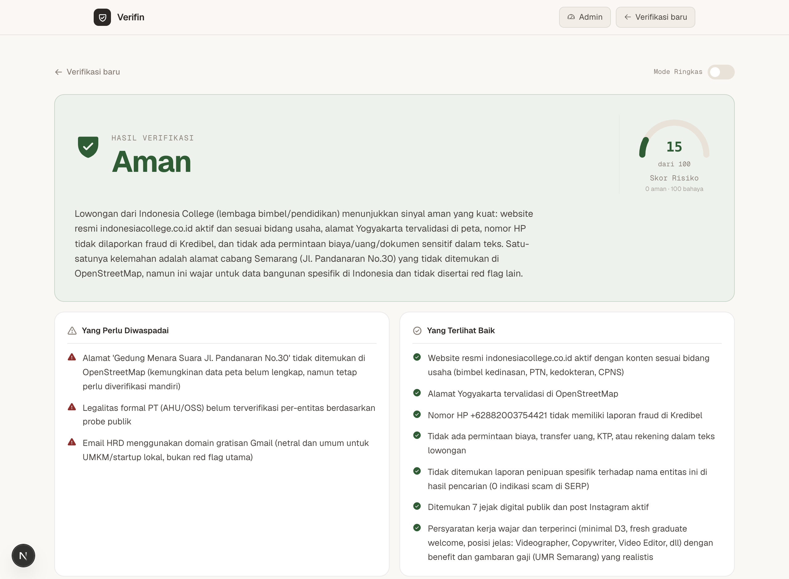

# PROPOSAL PAGELARAN MAHASISWA NASIONAL BIDANG TEKNOLOGI INFORMASI DAN KOMUNIKASI (GEMASTIK) XIX
## DIVISI PENGEMBANGAN PERANGKAT LUNAK

**Nama Tim:** Verifin
**Anggota Tim:**
1. Hafidz Rizqullah Prasetya
2. Matthew Hayunaji Priantara
3. Akmal Manggala Putra

**Universitas Gadjah Mada**
**Yogyakarta**
**2026**

---

## DAFTAR ISI
*   [A. Latar Belakang Ide Perangkat Lunak](#a-latar-belakang-ide-perangkat-lunak)
*   [B. Tujuan dan Manfaat Dikembangkannya Perangkat Lunak](#b-tujuan-dan-manfaat-dikembangkannya-perangkat-lunak)
*   [C. Batasan Perangkat Lunak yang Dikembangkan](#c-batasan-perangkat-lunak-yang-dikembangkan)
*   [D. Metodologi Pengembangan Perangkat Lunak](#d-metodologi-pengembangan-perangkat-lunak)
*   [E. Analisis Kebutuhan dan Desain Solusi Perangkat Lunak](#e-analisis-kebutuhan-dan-desain-solusi-perangkat-lunak)
*   [F. Implementasi Perangkat Lunak](#f-implementasi-perangkat-lunak)
*   [Daftar Pustaka](#daftar-pustaka)

---

## A. Latar Belakang Ide Perangkat Lunak

Tingkat pengangguran terbuka di Indonesia masih menjadi salah satu tantangan ekonomi nasional yang signifikan. Berdasarkan data Badan Pusat Statistik (BPS), per Februari 2025 jumlah pengangguran terbuka tercatat mencapai 7,28 juta orang, meningkat dibandingkan periode sebelumnya [1]. Di tengah tekanan tersebut, jutaan pencari kerja Indonesia setiap harinya menerima tawaran lowongan dari berbagai kanal yang tidak terverifikasi: Instagram, WhatsApp, Telegram, grup Facebook, hingga papan pengumuman fisik. Platform-platform ini menyebarkan lowongan secara masif, namun **tidak ada satu pun mekanisme yang menjawab pertanyaan mendasar: "Apakah lowongan ini layak dipercaya?"**

Akibatnya, pencari kerja harus melakukan investigasi manual secara mandiri: mencari nama perusahaan di Google, mengecek nomor HP di direktori, melihat lokasi di Maps, menelusuri ulasan di media sosial. Proses ini melelahkan, tidak sistematis, dan sering kali terlambat karena korban baru menyadari penipuan setelah menyerahkan data pribadi atau uang. Menurut laporan *Global State of Scams* oleh Global Anti-Scam Alliance (GASA), Indonesia menempati salah satu peringkat kerentanan tertinggi di Asia Tenggara dengan 49% penduduk mengalami kerugian akibat penipuan [2]. Lebih jauh, krisis ini tidak hanya berujung pada kerugian finansial, melainkan telah bergeser menjadi pintu masuk Tindak Pidana Perdagangan Orang (TPPO): ribuan pencari kerja terjebak iklan pekerjaan palsu di luar negeri dan dipaksa bekerja sebagai operator penipuan siber (*scam center*) [3].

Celah yang sesungguhnya bukan pada minimnya informasi, melainkan pada **tidak adanya infrastruktur kepercayaan** (*trust infrastructure*) di ekosistem rekrutmen informal Indonesia. Platform rekrutmen formal seperti LinkedIn atau Glints memiliki mekanisme verifikasi perusahaan, namun sebagian besar lowongan beredar di luar platform tersebut, yaitu di media sosial dan aplikasi pesan. Di sinilah Verifin hadir: bukan sebagai pengganti platform rekrutmen, melainkan sebagai **platform pendamping pencari kerja** yang membantu pengguna menilai tingkat kepercayaan suatu lowongan *sebelum* mereka memutuskan untuk melamar.

Di balik antarmuka yang sederhana, Verifin ditenagai oleh **Job Trust Infrastructure** — sebuah lapisan intelijen yang menggabungkan *Open Source Intelligence* (OSINT) otomatis, analisis bukti berbasis machine learning, dan pemantauan komunitas secara berkelanjutan. Ketika pengguna menempelkan teks atau tautan lowongan, sistem secara otomatis mengekstrak entitas penting (nama perusahaan, lokasi, nomor kontak), menjalankan pengecekan lintas sumber secara paralel, lalu menghasilkan *Trust Score* 0–100 beserta verdict tiga tingkat — **AMAN**, **WASPADA**, atau **BAHAYA** — dilengkapi penjelasan yang dapat dipahami oleh pengguna awam.

Pendekatan ini sejalan dengan penelitian terkini di bidang deteksi penipuan rekrutmen daring. Liu et al. [4] membuktikan bahwa penggabungan fitur teks dengan informasi kontekstual (lokasi, industri, jenis kontrak) secara signifikan meningkatkan akurasi deteksi dibandingkan pendekatan berbasis teks semata. Pemanfaatan OSINT untuk investigasi digital juga telah terbukti efektif dalam berbagai konteks keamanan siber [8]. Sementara itu, pendekatan *Explainable AI* (XAI) terbukti meningkatkan kepercayaan pengguna terhadap sistem keamanan otomatis karena pengguna dapat memahami *mengapa* sebuah keputusan diambil [7].

Yang membedakan Verifin dari solusi yang ada adalah pendekatan **evidence-based reasoning**: model LLM yang digunakan (kimi-k3-high via OpenAgentic API) hanya diperbolehkan menarik kesimpulan berdasarkan fakta-fakta OSINT yang telah dikumpulkan secara terverifikasi, bukan berdasarkan spekulasi atau pengetahuan umum semata. Selain itu, mekanisme *community monitoring* memungkinkan pengguna melaporkan lowongan mencurigakan sehingga sistem secara kolektif semakin cerdas dari waktu ke waktu. Dengan demikian, Verifin bukan hanya alat deteksi — ia adalah **infrastruktur kepercayaan kerja** yang dibangun untuk melindungi pencari kerja Indonesia di era rekrutmen digital yang semakin kompleks.

## B. Tujuan dan Manfaat Dikembangkannya Perangkat Lunak

### Tujuan

1. Mengembangkan platform pendamping pencari kerja berbasis web yang memungkinkan pengguna menilai tingkat kepercayaan suatu lowongan kerja secara cepat, transparan, dan berbasis bukti sebelum memutuskan untuk melamar.
2. Membangun *Job Trust Infrastructure* yang mengintegrasikan ekstraksi entitas otomatis (NER), klasifikasi perilaku teks (NLP), pengumpulan intelijen sumber terbuka (OSINT) paralel, penalaran berbasis bukti menggunakan LLM, dan penjelasan keputusan yang dapat diinterpretasi (*Explainable AI*).
3. Menghasilkan *Trust Score* 0–100 dan verdict tiga tingkat (AMAN / WASPADA / BAHAYA) yang disertai penjelasan berbasis fitur sehingga pengguna memahami dasar penilaian, bukan sekadar menerima label biner.
4. Menyediakan mekanisme *community monitoring* berbasis pelaporan kolektif yang memungkinkan sistem terus diperbarui dengan informasi penipuan terbaru dari pengguna aktif.
5. Memberikan kontribusi terhadap upaya pemberantasan TPPO berbasis rekrutmen digital melalui pendekatan teknologi yang dapat diakses oleh masyarakat umum.

### Manfaat

**Bagi Pencari Kerja:**
- Mendapatkan penilaian kepercayaan lowongan secara instan tanpa perlu melakukan investigasi manual yang melelahkan.
- Memahami *mengapa* sebuah lowongan dinilai berisiko melalui penjelasan berbasis fitur yang transparan.
- Terlindungi dari jebakan lowongan palsu sebelum menyerahkan data pribadi atau dokumen sensitif.
- Dapat berkontribusi melindungi sesama pencari kerja melalui mekanisme pelaporan komunitas.

**Bagi Ekosistem Rekrutmen:**
- Mendorong standar transparansi yang lebih tinggi dalam penyebaran lowongan di media sosial dan platform informal.
- Menyediakan *fraud fingerprint* dan mesin deduplikasi yang dapat mengidentifikasi jaringan lowongan palsu yang saling berkaitan.
- Membangun basis data bukti penipuan rekrutmen yang terstruktur dan dapat digunakan untuk keperluan penelitian dan penegakan hukum.

**Bagi Masyarakat dan Negara:**
- Mengurangi kerentanan kelompok rentan (fresh graduate, pengangguran, pencari kerja di daerah) terhadap penipuan rekrutmen.
- Berkontribusi pada pencegahan TPPO melalui deteksi dini lowongan pekerjaan palsu yang menjadi pintu masuk perdagangan manusia [3].
- Menyediakan infrastruktur kepercayaan yang dapat diintegrasikan dengan platform rekrutmen, instansi pemerintah, atau lembaga perlindungan konsumen.

---

## C. Batasan Perangkat Lunak yang Dikembangkan

Untuk memastikan kualitas dan keandalan sistem dalam cakupan pengembangan yang realistis, Verifin memiliki batasan-batasan berikut:

1. **Bahasa Input:** Sistem dioptimalkan untuk memproses teks lowongan dalam Bahasa Indonesia. Input dalam bahasa asing dapat diproses namun akurasi ekstraksi entitas dan klasifikasi perilaku teks tidak dijamin.

2. **Sumber Input:** Pengguna memasukkan teks lowongan secara manual (tempel teks) atau melalui URL tautan lowongan. Sistem tidak melakukan *crawling* otomatis terhadap platform media sosial secara real-time.

3. **Cakupan OSINT:** Verifikasi OSINT mencakup: pengecekan domain/WHOIS, geocoding lokasi via OpenStreetMap/Nominatim, pengecekan reputasi via Kredibel.id, penelusuran web via DuckDuckGo dan Yahoo SERP, scraping halaman web perusahaan, serta penelusuran identitas media sosial. Sistem tidak mengakses database pemerintah (AHU, SIUP) secara langsung karena keterbatasan akses API resmi.

4. **Model Klasifikasi:** Klasifikasi perilaku teks menggunakan TF-IDF + Logistic Regression yang dilatih pada dataset lowongan berbahasa Indonesia. Model ini bukan model bahasa besar (*large language model*) dan tidak memiliki kemampuan pemahaman semantik mendalam. Peran LLM (kimi-k3-high via OpenAgentic API) terbatas pada sintesis dan penalaran akhir berdasarkan hasil OSINT yang telah dikumpulkan.

5. **Graf Jaringan:** Analisis jaringan penipuan (*fraud network*) menggunakan graf in-memory berbasis NetworkX. Graf ini dibangun secara dinamis dari data yang tersimpan di PostgreSQL dan tidak persisten antar sesi analisis. Visualisasi graf disediakan melalui antarmuka interaktif di frontend.

6. **Kapasitas Sistem:** Pada tahap pengembangan, sistem dirancang untuk menangani permintaan analisis secara sekuensial per pengguna. Skalabilitas horizontal untuk beban tinggi berada di luar cakupan pengembangan saat ini.

7. **Verdict Bukan Putusan Hukum:** *Trust Score* dan verdict yang dihasilkan Verifin merupakan penilaian berbasis probabilistik dan OSINT, bukan keputusan hukum. Pengguna tetap disarankan untuk melakukan due diligence tambahan sebelum melamar pekerjaan.

8. **Komunitas:** Fitur *community monitoring* pada tahap ini mencakup pelaporan dan pemungutan suara (*upvote/downvote*) laporan. Moderasi laporan dilakukan secara algoritmik berdasarkan konsensus komunitas, bukan moderasi manual oleh tim.

---

## D. Metodologi Pengembangan Perangkat Lunak

Verifin dikembangkan menggunakan metodologi **Agile Scrum** dengan dua sprint pengembangan yang masing-masing berdurasi tiga minggu. Pendekatan ini dipilih karena kompleksitas integrasi multi-layer (NER, NLP, OSINT, LLM, XAI) membutuhkan siklus iterasi yang pendek untuk memvalidasi setiap komponen sebelum melanjutkan ke lapisan berikutnya.

### Struktur Tim

| Peran | Anggota | Tanggung Jawab Utama |
|---|---|---|
| *Project Lead* & Backend Engineer | Hafidz Rizqullah Prasetya | Arsitektur sistem, pipeline analisis, API FastAPI |
| Frontend Engineer & UI/UX | Matthew Hayunaji Priantara | Next.js frontend, visualisasi graf, desain interaksi |
| Data Engineer & OSINT Specialist | Akmal Manggala Putra | Modul OSINT, model NLP, database PostgreSQL |

### Sprint 1 — Fondasi Infrastruktur (Minggu 1–3)

**Tujuan:** Membangun fondasi *Job Trust Infrastructure* — dari input teks hingga hasil OSINT mentah tersimpan di database.

**Backlog Sprint 1:**
- [ ] Setup repositori, lingkungan pengembangan, dan CI/CD pipeline dasar
- [ ] Inisialisasi database PostgreSQL (Supabase): skema tabel `jobs`, `osint_results`, `community_reports`, `fraud_fingerprints`
- [ ] Implementasi modul NER berbasis regex untuk ekstraksi entitas (nama perusahaan, lokasi, nomor telepon, URL, nominal gaji)
- [ ] Implementasi modul klasifikasi NLP: TF-IDF feature extraction + Logistic Regression untuk deteksi pola teks mencurigakan
- [ ] Implementasi pipeline OSINT paralel: WHOIS lookup, OSM/Nominatim geocoding, Kredibel.id scraping, DuckDuckGo SERP, Yahoo SERP, Scrapling, Social OSINT
- [ ] Implementasi *fraud fingerprint* dan mesin deduplikasi berbasis hash entitas
- [ ] Implementasi graf in-memory NetworkX untuk analisis konektivitas jaringan penipuan
- [ ] API endpoint dasar: `POST /api/analyze` dan `GET /api/jobs/{job_id}`
- [ ] Unit test untuk setiap modul OSINT dan NLP

**Kriteria Selesai Sprint 1:** Sistem dapat menerima input teks lowongan, mengekstrak entitas, menjalankan seluruh modul OSINT secara paralel, dan menyimpan hasil ke database PostgreSQL.

### Sprint 2 — Integrasi LLM, XAI, dan Frontend (Minggu 4–6)

**Tujuan:** Mengintegrasikan lapisan LLM dan XAI, membangun frontend, serta mengimplementasikan fitur komunitas.

**Backlog Sprint 2:**
- [ ] Implementasi LLM reasoning layer: integrasi kimi-k3-high via OpenAgentic API dengan *evidence-only prompting* (LLM hanya menggunakan fakta OSINT terverifikasi)
- [ ] Implementasi kalkulasi *Trust Score* 0–100 berbasis agregasi tertimbang hasil seluruh layer
- [ ] Implementasi custom SHAP-inspired additive feature explainer (XAI) untuk menghasilkan penjelasan kontribusi fitur per verdict
- [ ] Implementasi verdict tiga tingkat: AMAN / WASPADA / BAHAYA dengan threshold kalibrat
- [ ] Pengembangan frontend Next.js: halaman input, halaman hasil analisis, visualisasi graf jaringan interaktif
- [ ] Implementasi fitur *community monitoring*: pelaporan lowongan mencurigakan, upvote/downvote laporan, agregasi skor komunitas
- [ ] Integrasi frontend dengan seluruh API backend
- [ ] *End-to-end testing* dengan sampel lowongan nyata (valid dan palsu)
- [ ] Optimasi performa pipeline analisis dan pengujian beban dasar
- [ ] Penyempurnaan UI/UX berdasarkan pengujian pengguna internal

**Kriteria Selesai Sprint 2:** Pengguna dapat memasukkan lowongan, melihat *Trust Score*, verdict, penjelasan XAI, graf jaringan, dan melaporkan lowongan mencurigakan melalui antarmuka web yang fungsional.

### Diagram Alur Metodologi

```
Sprint 1 (Minggu 1-3)          Sprint 2 (Minggu 4-6)
========================       ========================
Setup & DB Schema          ->  LLM Reasoning Layer
NER Module                 ->  Trust Score Calculator
NLP Classifier             ->  XAI Explainer
OSINT Parallel Pipeline    ->  Frontend Next.js
Fraud Fingerprint          ->  Community Monitoring
NetworkX Graph             ->  E2E Testing & Polish
API Endpoints              ->  Deployment
```

---
## E. Analisis Kebutuhan dan Desain Solusi Perangkat Lunak

### E.1 Analisis Kebutuhan Fungsional

**FR-01: Analisis Lowongan dari Input Teks**
Sistem harus dapat menerima input berupa teks lowongan kerja dalam format bebas (copy-paste dari WhatsApp, Instagram, Telegram, dll.) dan memproses seluruh pipeline analisis secara otomatis.

**FR-02: Analisis Lowongan dari URL**
Sistem harus dapat menerima input berupa URL tautan lowongan, mengambil konten halaman secara otomatis menggunakan Scrapling, dan memproses teks yang diekstrak melalui pipeline analisis.

**FR-03: Ekstraksi Entitas Otomatis (NER)**
Sistem harus mengekstrak entitas-entitas kunci dari teks lowongan menggunakan modul NER berbasis regex, meliputi: nama perusahaan, lokasi/alamat, nomor telepon/WhatsApp, alamat email, URL perusahaan, nominal gaji, dan jenis pekerjaan.

**FR-04: Klasifikasi Perilaku Teks (NLP)**
Sistem harus mengklasifikasikan teks lowongan menggunakan TF-IDF + Logistic Regression untuk mengidentifikasi pola-pola linguistik yang berkorelasi dengan lowongan tidak terpercaya, seperti: janji gaji tidak realistis, permintaan dokumen sensitif di awal, tekanan waktu, ketidakjelasan deskripsi kerja, dan ketidakcocokan antara posisi dan persyaratan.

**FR-05: Pipeline OSINT Paralel**
Sistem harus menjalankan modul-modul OSINT secara paralel terhadap entitas yang diekstrak, meliputi:
- WHOIS lookup terhadap domain perusahaan (usia domain, registrar, privasi registrasi)
- Geocoding dan validasi lokasi via OpenStreetMap/Nominatim
- Pengecekan reputasi perusahaan via Kredibel.id
- Penelusuran web via DuckDuckGo SERP dan Yahoo SERP
- Scraping halaman web perusahaan via Scrapling
- Penelusuran jejak digital media sosial (Social OSINT)

**FR-06: Analisis Jaringan Penipuan (Fraud Network Graph)**
Sistem harus membangun graf in-memory menggunakan NetworkX yang merepresentasikan koneksi antar entitas (nomor telepon, domain, nama perusahaan, lokasi) lintas lowongan yang tersimpan di database, untuk mendeteksi jaringan penipuan yang menggunakan identitas berbeda namun berbagi infrastruktur yang sama.

**FR-07: Fraud Fingerprint dan Deduplikasi**
Sistem harus menghasilkan *fraud fingerprint* untuk setiap lowongan berdasarkan hash kombinasi entitas kunci (nomor telepon, domain, nama perusahaan) dan mendeteksi lowongan duplikat atau varian dari lowongan yang pernah dilaporkan sebelumnya.

**FR-08: LLM Reasoning Berbasis Bukti**
Sistem harus menggunakan kimi-k3-high via OpenAgentic API untuk melakukan sintesis dan penalaran akhir, dengan constraint ketat: model hanya diperbolehkan menggunakan fakta-fakta OSINT yang telah dikumpulkan dan diverifikasi dalam sesi analisis berjalan. Model dilarang membuat klaim berdasarkan pengetahuan umum yang tidak didukung oleh bukti OSINT.

**FR-09: Trust Score dan Verdict Tiga Tingkat**
Sistem harus menghasilkan *Trust Score* berupa nilai integer 0–100 beserta verdict tiga tingkat:
- **AMAN** (skor 70–100): Lowongan memiliki indikator kepercayaan yang kuat dari verifikasi OSINT
- **WASPADA** (skor 40–69): Terdapat beberapa sinyal meragukan namun bukti tidak konklusif
- **BAHAYA** (skor 0–39): Terdapat indikator kuat penipuan dari verifikasi OSINT

**FR-10: Penjelasan XAI Berbasis Fitur**
Sistem harus menghasilkan penjelasan kontribusi fitur terhadap *Trust Score* menggunakan custom SHAP-inspired additive feature explainer, menampilkan fitur-fitur yang paling berkontribusi terhadap kenaikan atau penurunan skor beserta nilai kontribusinya dalam bahasa yang dapat dipahami pengguna awam.

**FR-11: Visualisasi Graf Jaringan Interaktif**
Sistem harus menampilkan visualisasi graf interaktif di frontend yang menunjukkan koneksi antara entitas lowongan yang sedang dianalisis dengan entitas-entitas lain dalam database, memungkinkan pengguna melihat apakah suatu nomor telepon atau domain terhubung dengan laporan penipuan sebelumnya.

**FR-12: Community Monitoring dan Pelaporan**
Sistem harus menyediakan fitur bagi pengguna untuk:
- Melaporkan lowongan sebagai mencurigakan dengan mengisi formulir laporan
- Memberikan *upvote/downvote* terhadap laporan yang ada
- Melihat daftar lowongan yang telah dilaporkan beserta agregasi skor komunitas

**FR-13: Riwayat Analisis Pengguna**
Sistem harus menyimpan riwayat analisis yang pernah dilakukan pengguna (berdasarkan sesi atau akun) sehingga pengguna dapat mengakses kembali hasil analisis sebelumnya.

**FR-14: API Publik untuk Integrasi**
Sistem harus menyediakan REST API yang terdokumentasi (via FastAPI auto-docs) untuk memungkinkan integrasi dengan platform pihak ketiga seperti ekstensi browser atau bot Telegram.

### E.2 Analisis Kebutuhan Non-Fungsional

**NFR-01: Performa**
Pipeline analisis lengkap (NER → NLP → OSINT → LLM → XAI) harus selesai dalam waktu maksimal 30 detik untuk 90% permintaan. Modul OSINT dijalankan secara paralel untuk meminimalkan latensi kumulatif.

**NFR-02: Ketersediaan**
Sistem harus memiliki uptime minimal 95% selama periode demonstrasi dan evaluasi.

**NFR-03: Keamanan**
- Input pengguna divalidasi dan disanitasi sebelum diproses untuk mencegah injeksi
- API key untuk layanan eksternal (OpenAgentic, Supabase) disimpan sebagai environment variable, tidak di-hardcode
- Rate limiting diterapkan pada endpoint analisis untuk mencegah penyalahgunaan

**NFR-04: Skalabilitas**
Arsitektur berbasis FastAPI memungkinkan horizontal scaling. Database PostgreSQL di Supabase mendukung koneksi pooling untuk beban tinggi.

**NFR-05: Kemudahan Penggunaan**
Antarmuka pengguna dirancang untuk dapat digunakan oleh pencari kerja awam tanpa pelatihan teknis. Proses analisis cukup dengan menempel teks lowongan dan menekan tombol "Analisis".

**NFR-06: Transparansi**
Setiap verdict harus disertai dengan penjelasan berbasis fitur yang dapat dipahami. Sistem tidak boleh menghasilkan verdict tanpa penjelasan yang dapat diverifikasi.

### E.3 Desain Solusi: Arsitektur Sistem

Verifin mengimplementasikan arsitektur berlapis (*layered architecture*) yang memisahkan tanggung jawab setiap komponen secara jelas:

```
┌─────────────────────────────────────────────────────┐
│                   FRONTEND LAYER                     │
│         Next.js + Tailwind + Phosphor Icons          │
│              + motion/react animations               │
│   [Input Form] [Result Dashboard] [Network Graph]   │
│         [Community Reports] [History]                │
└──────────────────────┬──────────────────────────────┘
                       │ REST API
┌──────────────────────▼──────────────────────────────┐
│                  BACKEND LAYER                       │
│              FastAPI (Python 3.11)                   │
│  POST /api/analyze  GET /api/jobs/{id}               │
│  POST /api/reports  GET /api/community               │
└──────────────────────┬──────────────────────────────┘
                       │
┌──────────────────────▼──────────────────────────────┐
│           JOB TRUST INFRASTRUCTURE                   │
│                                                      │
│  Layer 1: NER (Regex-based Entity Extraction)        │
│     └── Perusahaan, Lokasi, Kontak, URL, Gaji        │
│                                                      │
│  Layer 2: NLP Classifier                             │
│     └── TF-IDF + Logistic Regression          │
│         Behavioral Feature Analysis                   │
│                                                      │
│  Layer 3: OSINT Paralel                              │
│     ├── WHOIS Lookup                                 │
│     ├── OSM/Nominatim Geocoding                      │
│     ├── Kredibel.id Reputation Check                 │
│     ├── DuckDuckGo SERP                              │
│     ├── Yahoo SERP                                   │
│     ├── Scrapling Web Scraper                        │
│     └── Social OSINT                                 │
│                                                      │
│  Layer 4: LLM Reasoning (Evidence-Only)              │
│     └── kimi-k3-high via OpenAgentic API                     │
│         [hanya fakta OSINT terverifikasi]            │
│                                                      │
│  Layer 5: XAI + Trust Score Calculator               │
│     └── Custom SHAP-inspired Additive Explainer      │
│         Trust Score 0-100 + Verdict AMAN/WASPADA/BAHAYA│
└──────────────────────┬──────────────────────────────┘
                       │
┌──────────────────────▼──────────────────────────────┐
│              DATA & GRAPH LAYER                      │
│   PostgreSQL (Supabase)     NetworkX (In-Memory)     │
│   - jobs                    - Fraud Network Graph    │
│   - osint_results           - Entity Connectivity    │
│   - community_reports       - Cluster Detection      │
│   - fraud_fingerprints                               │
└─────────────────────────────────────────────────────┘
```

### E.4 Desain Pipeline Analisis 5-Layer

**Layer 1 — Named Entity Recognition (NER)**

Modul NER menggunakan pendekatan berbasis regex yang dikalibrasi untuk pola teks berbahasa Indonesia. Pendekatan ini dipilih karena pola entitas dalam konteks lowongan kerja bersifat relatif terstruktur (nomor telepon Indonesia, format alamat email, pola URL, nominal gaji dalam Rupiah) sehingga tidak memerlukan model bahasa besar untuk tugas ini. Entitas yang diekstrak menjadi input primer untuk Layer 3 (OSINT).

**Layer 2 — NLP Behavioral Feature Classifier**

Teks lowongan direpresentasikan menggunakan TF-IDF (*Term Frequency-Inverse Document Frequency*) yang menangkap pola linguistik khas lowongan mencurigakan. Fitur TF-IDF kemudian diklasifikasikan menggunakan Logistic Regression yang dilatih pada dataset lowongan berlabel berbahasa Indonesia. Classifier ini mendeteksi sinyal perilaku tekstual seperti: penggunaan kata-kata yang membangkitkan urgensi berlebihan, janji kompensasi tidak realistis, ketidakjelasan deskripsi tugas, dan permintaan dokumen sensitif di tahap awal. Keluaran Layer 2 berupa skor probabilistik yang menjadi salah satu komponen kalkulasi *Trust Score* akhir.

**Layer 3 — OSINT Paralel**

Ini adalah inti dari *Job Trust Infrastructure*. Setelah entitas diekstrak pada Layer 1, sistem menjalankan tujuh modul OSINT secara paralel menggunakan Python asyncio:

1. **WHOIS Lookup**: Memverifikasi usia domain perusahaan, registrar, dan status privasi. Domain yang baru didaftarkan (< 6 bulan) atau menggunakan layanan privasi registrasi merupakan sinyal risiko tinggi.
2. **Geocoding (OSM/Nominatim)**: Memvalidasi apakah alamat yang disebutkan dalam lowongan benar-benar ada dan sesuai dengan jenis bisnis yang diklaim.
3. **Kredibel.id**: Mengecek reputasi nomor telepon dan nama perusahaan di database pengaduan konsumen Indonesia.
4. **DuckDuckGo SERP**: Mencari pemberitaan atau diskusi online tentang perusahaan dan nomor kontak untuk menemukan indikasi penipuan yang dilaporkan sebelumnya.
5. **Yahoo SERP**: Melengkapi hasil pencarian dari DuckDuckGo untuk meningkatkan cakupan.
6. **Scrapling**: Mengakses dan menganalisis halaman web resmi perusahaan (jika ada) untuk memverifikasi konsistensi informasi.
7. **Social OSINT**: Menelusuri jejak digital identitas perusahaan di platform media sosial.

**Layer 4 — LLM Reasoning (Evidence-Only)**

Seluruh hasil OSINT dari Layer 3 dikompilasi menjadi *evidence bundle* terstruktur yang dikirimkan ke kimi-k3-high via OpenAgentic API. Model LLM bertugas melakukan sintesis naratif dan mengidentifikasi inkonsistensi lintas sumber yang mungkin tidak tertangkap oleh aturan deterministik. Kunci dari lapisan ini adalah *evidence-only constraint*: prompt system secara eksplisit melarang model membuat klaim yang tidak didukung oleh data dalam *evidence bundle*. Ini memastikan penjelasan yang dihasilkan dapat diaudit dan diverifikasi.

**Layer 5 — XAI + Trust Score Calculator**

Keluaran dari seluruh layer sebelumnya diagregasi menggunakan bobot yang telah dikalibrasi menjadi *Trust Score* 0–100. Custom SHAP-inspired additive feature explainer kemudian menghitung kontribusi marginal setiap fitur terhadap skor akhir, menghasilkan penjelasan berbentuk daftar faktor positif dan negatif yang disajikan dalam bahasa Indonesia yang mudah dipahami. Pendekatan aditif ini dipilih karena lebih transparan dan efisien dibandingkan menggunakan library SHAP konvensional yang memerlukan komputasi intensif.

### E.5 Desain Fraud Fingerprint dan Deduplikasi

Setiap lowongan yang dianalisis menghasilkan *fraud fingerprint* — sebuah identifikasi unik berdasarkan hash kombinasi entitas kunci (domain, nomor telepon, nama perusahaan yang dinormalisasi). Fingerprint ini disimpan di tabel `fraud_fingerprints` di PostgreSQL dan digunakan untuk:

1. **Deteksi Duplikat**: Jika lowongan baru memiliki fingerprint yang sama atau sangat mirip dengan lowongan yang sudah ada (Hamming distance < threshold), sistem dapat langsung mengembalikan hasil analisis sebelumnya tanpa menjalankan ulang seluruh pipeline.
2. **Deteksi Varian**: Penipu sering mengubah detail minor (nama perusahaan, nomor telepon) namun mempertahankan infrastruktur yang sama. Graf NetworkX memungkinkan deteksi koneksi antar fingerprint yang berbagi entitas.
3. **Penguatan Skor Komunitas**: Fingerprint yang telah dilaporkan oleh banyak pengguna mendapat penalti skor otomatis.

### E.6 Desain Graf Jaringan Penipuan (NetworkX)

Graf jaringan dibangun secara in-memory menggunakan NetworkX setiap kali analisis baru dilakukan. Node dalam graf merepresentasikan entitas (nomor telepon, domain, nama perusahaan, lokasi), sedangkan edge merepresentasikan co-occurrence antar entitas dalam lowongan yang sama. Algoritma deteksi komunitas (*community detection*) dijalankan untuk mengidentifikasi kluster entitas yang saling terhubung, mengindikasikan jaringan penipuan yang beroperasi dengan identitas berbeda namun infrastruktur bersama.

Visualisasi graf disajikan di frontend sebagai graf interaktif menggunakan library visualisasi JavaScript, memungkinkan pengguna menjelajahi koneksi antar entitas secara intuitif.

### E.7 Desain Antarmuka Pengguna

Antarmuka Verifin dirancang dengan prinsip **simplicity-first**: pengguna hanya perlu satu tindakan (menempel teks atau URL) untuk mendapatkan penilaian lengkap. Desain menggunakan Next.js dengan Tailwind CSS, Phosphor Icons, dan motion/react untuk animasi transisi.

**Halaman Utama (Input):**
Kotak teks besar di tengah halaman dengan placeholder "Tempel teks lowongan di sini..." atau field URL. Tombol "Analisis Sekarang" yang menonjol. Di bawahnya, counter statistik komunitas (total analisis, total laporan, lowongan berbahaya terdeteksi hari ini).

**Halaman Hasil Analisis:**
- Header besar menampilkan verdict (AMAN / WASPADA / BAHAYA) dengan warna semantik (hijau / kuning / merah) dan Trust Score 0–100
- Section "Temuan Utama": penjelasan naratif dari LLM dalam bahasa Indonesia
- Section "Breakdown Skor": visualisasi kontribusi fitur dari XAI explainer (bar chart horizontal)
- Section "Detail OSINT": tab per modul OSINT dengan hasil mentah yang dapat dieksplorasi
- Section "Graf Jaringan": visualisasi interaktif koneksi entitas
- Tombol "Laporkan ke Komunitas" untuk mendorong partisipasi crowdsourcing

**Halaman Komunitas:**
Daftar laporan terbaru dari komunitas, filter berdasarkan verdict dan tanggal, fitur pencarian, dan statistik agregat.

---
## F. Implementasi Perangkat Lunak

### F.1 Spesifikasi Teknologi

| Komponen | Teknologi | Keterangan |
|---|---|---|
| Backend Framework | FastAPI (Python 3.11) | REST API asinkron, auto-docs Swagger/OpenAPI |
| Database | PostgreSQL via Supabase | Penyimpanan persisten, RLS, real-time subscriptions |
| Graf Analisis | NetworkX (in-memory) | Analisis jaringan penipuan, deteksi komunitas |
| NER | Regex-based NER | Ekstraksi entitas khusus konteks lowongan Indonesia |
| NLP Classifier | TF-IDF + Logistic Regression | Klasifikasi perilaku teks berbahasa Indonesia |
| LLM | kimi-k3-high via OpenAgentic API | Penalaran berbasis bukti, sintesis naratif |
| OSINT: Domain | WHOIS lookup | Verifikasi usia dan reputasi domain |
| OSINT: Lokasi | OSM / Nominatim | Geocoding dan validasi alamat |
| OSINT: Reputasi | Kredibel.id | Database pengaduan konsumen Indonesia |
| OSINT: Web Search | DuckDuckGo SERP, Yahoo SERP | Penelusuran berita dan diskusi online |
| OSINT: Scraping | Scrapling | Akses konten halaman web perusahaan |
| OSINT: Sosial | Social OSINT module | Jejak digital media sosial |
| XAI | Custom SHAP-inspired Explainer | Penjelasan kontribusi fitur aditif |
| Frontend Framework | Next.js (App Router) | SSR/SSG, routing, API routes |
| Styling | Tailwind CSS | Utility-first, responsive design |
| Ikon | Phosphor Icons | Konsistensi visual, lightweight |
| Animasi | motion/react | Transisi halus, micro-interactions |
| Deployment | Vercel (Frontend) + Railway/Fly.io (Backend) | CI/CD otomatis dari GitHub |

### F.2 Struktur Repositori

```
verifin/
├── backend/
│   ├── app/
│   │   ├── main.py                    # FastAPI app entry point
│   │   ├── api/
│   │   │   ├── routes/
│   │   │   │   ├── analyze.py         # POST /api/analyze
│   │   │   │   ├── jobs.py            # GET /api/jobs/{id}
│   │   │   │   └── community.py       # POST/GET /api/reports
│   │   ├── core/
│   │   │   ├── pipeline.py            # Orchestrator 5-layer pipeline
│   │   │   ├── ner.py                 # Regex-based NER module
│   │   │   ├── nlp_classifier.py      # TF-IDF + Logistic Regression
│   │   │   ├── osint/
│   │   │   │   ├── whois_lookup.py
│   │   │   │   ├── geocoding.py
│   │   │   │   ├── kredibel.py
│   │   │   │   ├── ddg_serp.py
│   │   │   │   ├── yahoo_serp.py
│   │   │   │   ├── scrapling_scraper.py
│   │   │   │   └── social_osint.py
│   │   │   ├── llm_reasoning.py       # kimi-k3-high via OpenAgentic, evidence-only
│   │   │   ├── trust_score.py         # Score aggregation + verdict
│   │   │   ├── xai_explainer.py       # Custom SHAP-inspired explainer
│   │   │   ├── fraud_fingerprint.py   # Hashing + deduplication
│   │   │   └── network_graph.py       # NetworkX fraud network
│   │   ├── models/
│   │   │   ├── job.py                 # Pydantic models: Job, AnalysisResult
│   │   │   ├── osint.py               # OsintResult, OsintBundle
│   │   │   └── report.py              # CommunityReport, Verdict
│   │   └── db/
│   │       ├── supabase_client.py     # Supabase/PostgreSQL connection
│   │       └── queries.py             # SQL queries & ORM helpers
│   ├── tests/
│   │   ├── test_ner.py
│   │   ├── test_nlp.py
│   │   ├── test_osint.py
│   │   └── test_pipeline.py
│   └── requirements.txt
├── frontend/
│   ├── src/
│   │   ├── app/
│   │   │   ├── page.tsx               # Halaman utama (input)
│   │   │   ├── result/[id]/page.tsx   # Halaman hasil analisis
│   │   │   └── community/page.tsx     # Halaman komunitas
│   │   ├── components/
│   │   │   ├── AnalysisForm.tsx       # Form input teks/URL
│   │   │   ├── VerdictBadge.tsx       # AMAN/WASPADA/BAHAYA badge
│   │   │   ├── TrustScoreGauge.tsx    # Visualisasi skor 0-100
│   │   │   ├── OsintBreakdown.tsx     # Detail hasil per modul OSINT
│   │   │   ├── XaiExplainer.tsx       # Breakdown kontribusi fitur
│   │   │   ├── FraudNetworkGraph.tsx  # Visualisasi graf interaktif
│   │   │   └── CommunityFeed.tsx      # Feed laporan komunitas
│   │   └── lib/
│   │       ├── api.ts                 # API client functions
│   │       └── types.ts               # TypeScript type definitions
│   ├── package.json
│   └── tailwind.config.ts
└── README.md
```

### F.3 Skema Database PostgreSQL

**Tabel `jobs`** — Menyimpan data lowongan dan hasil analisis:
```sql
CREATE TABLE jobs (
    id            UUID PRIMARY KEY DEFAULT gen_random_uuid(),
    input_text    TEXT NOT NULL,
    input_url     TEXT,
    created_at    TIMESTAMPTZ DEFAULT NOW(),
    status        VARCHAR(20) DEFAULT 'pending',  -- pending|processing|done|error
    trust_score   INTEGER,                         -- 0-100
    verdict       VARCHAR(10),                     -- AMAN|WASPADA|BAHAYA
    fingerprint   VARCHAR(64),                     -- SHA-256 hash entitas kunci
    entities      JSONB,                           -- Hasil ekstraksi NER
    nlp_score     FLOAT,                           -- Skor klasifikasi NLP
    osint_bundle  JSONB,                           -- Hasil seluruh modul OSINT
    llm_summary   TEXT,                            -- Narasi LLM berbasis bukti
    xai_factors   JSONB                            -- Kontribusi fitur XAI
);
```

**Tabel `community_reports`** — Menyimpan laporan pengguna:
```sql
CREATE TABLE community_reports (
    id            UUID PRIMARY KEY DEFAULT gen_random_uuid(),
    job_id        UUID REFERENCES jobs(id),
    reporter_ip   VARCHAR(45),                     -- Hashed IP
    report_text   TEXT,
    upvotes       INTEGER DEFAULT 0,
    downvotes     INTEGER DEFAULT 0,
    created_at    TIMESTAMPTZ DEFAULT NOW(),
    verified      BOOLEAN DEFAULT FALSE
);
```

**Tabel `fraud_fingerprints`** — Indeks deduplikasi:
```sql
CREATE TABLE fraud_fingerprints (
    fingerprint   VARCHAR(64) PRIMARY KEY,
    first_seen    TIMESTAMPTZ DEFAULT NOW(),
    last_seen     TIMESTAMPTZ DEFAULT NOW(),
    occurrence    INTEGER DEFAULT 1,
    avg_score     FLOAT,
    entity_hash   JSONB                            -- Komponen hash per entitas
);
```

### F.4 Contoh Alur Analisis End-to-End

Berikut adalah ilustrasi alur kerja sistem ketika pengguna mengirimkan teks lowongan:

**Input:**
```
Dibutuhkan Admin Online WFH
Gaji 8-15 juta/bulan
Syarat: min SMA, punya HP Android
Hubungi: 0812-XXXX-XXXX (Budi - HRD PT Sukses Mandiri)
Langsung kerja, tidak perlu pengalaman
Kirim foto dan KTP sekarang
```

**Layer 1 — NER Output:**
```json
{
  "company": "PT Sukses Mandiri",
  "contact_phone": "0812XXXXXXXX",
  "contact_name": "Budi",
  "role": "HRD",
  "position": "Admin Online",
  "work_type": "WFH",
  "salary_min": 8000000,
  "salary_max": 15000000,
  "requirements": ["min SMA", "HP Android"],
  "document_request": ["foto", "KTP"]
}
```

**Layer 2 — NLP Classifier Output:**
```json
{
  "nlp_risk_score": 0.87,
  "triggered_features": [
    "salary_unrealistic_wfh",
    "document_request_early",
    "no_experience_required",
    "urgency_language"
  ]
}
```

**Layer 3 — OSINT Bundle (paralel, ~8 detik):**
```json
{
  "whois": {"domain_found": false, "note": "Tidak ada domain terdaftar"},
  "geocoding": {"address_valid": false, "note": "Alamat tidak ditemukan"},
  "kredibel": {"reports": 3, "category": "penipuan_rekrutmen"},
  "ddg_serp": {"results": ["Waspada! Nomor ini dilaporkan penipuan - Kaskus 2025"]},
  "yahoo_serp": {"results": ["PT Sukses Mandiri tidak terdaftar di AHU"]},
  "scrapling": {"website_found": false},
  "social_osint": {"instagram": null, "linkedin": null}
}
```

**Layer 4 — LLM Reasoning Output (berbasis bukti):**
```
Berdasarkan fakta OSINT yang dikumpulkan: (1) nomor kontak 0812XXXXXXXX
tercatat dalam 3 laporan penipuan rekrutmen di Kredibel.id; (2) PT Sukses
Mandiri tidak memiliki kehadiran digital yang dapat diverifikasi (tidak ada
domain, website, atau akun media sosial resmi); (3) hasil pencarian web
mengkonfirmasi adanya pelaporan penipuan terkait nomor ini. Permintaan
dokumen identitas (KTP dan foto) di awal proses rekrutmen, dikombinasikan
dengan tawaran gaji yang sangat tinggi untuk posisi tanpa pengalaman,
merupakan pola konsisten penipuan rekrutmen berbasis phishing data pribadi.
```

**Layer 5 — Trust Score + XAI Output:**
```json
{
  "trust_score": 12,
  "verdict": "BAHAYA",
  "xai_factors": [
    {"factor": "Nomor dilaporkan penipuan (Kredibel.id)", "contribution": -28},
    {"factor": "Tidak ada kehadiran digital perusahaan", "contribution": -22},
    {"factor": "Permintaan KTP/foto di awal", "contribution": -18},
    {"factor": "Gaji tidak realistis untuk posisi WFH tanpa pengalaman", "contribution": -15},
    {"factor": "Pola teks urgency tinggi", "contribution": -5}
  ]
}
```

### F.5 Rencana Pengujian

**Unit Testing (Pytest):**
- Test ekstraksi entitas NER untuk berbagai format nomor telepon, nama perusahaan, dan alamat Indonesia
- Test klasifikasi NLP dengan sampel lowongan positif dan negatif yang berlabel
- Test setiap modul OSINT dengan mock responses untuk menghindari ketergantungan jaringan
- Test kalkulasi Trust Score dengan kombinasi input yang bervariasi
- Test deduplikasi fingerprint

**Integration Testing:**
- Test pipeline end-to-end dengan sampel lowongan nyata (10 AMAN, 10 WASPADA, 10 BAHAYA)
- Test API endpoint dengan Postman/pytest-httpx
- Test persistensi database dan konsistensi data

**User Acceptance Testing (UAT):**
- Pengujian dengan 5 pengguna target (fresh graduate, pencari kerja aktif) menggunakan protokol think-aloud
- Evaluasi keterbacaan penjelasan XAI oleh pengguna awam
- Pengujian fungsionalitas pelaporan komunitas

### F.6 Panduan Penggunaan Platform

**Cara Menggunakan Verifin:**

1. **Buka platform Verifin** di browser (web-based, tidak perlu instalasi)

2. **Masukkan lowongan yang ingin diperiksa** — tersedia dua cara:
   - *Tempel teks*: salin teks lowongan dari WhatsApp/Instagram/Telegram, tempel di kotak teks
   - *Masukkan URL*: tempel tautan lowongan dari website atau media sosial

3. **Klik tombol "Analisis Sekarang"** — sistem akan memproses lowongan melalui pipeline 5-layer secara otomatis (estimasi 15–30 detik)

4. **Baca hasil analisis:**
   - Lihat **verdict** (AMAN / WASPADA / BAHAYA) dan **Trust Score** 0–100 di bagian atas
   - Baca **penjelasan naratif** dari sistem yang menjelaskan mengapa lowongan dinilai demikian
   - Eksplorasi **breakdown skor** untuk melihat faktor-faktor yang mempengaruhi penilaian
   - Periksa **detail OSINT** untuk melihat hasil verifikasi per sumber
   - Jelajahi **graf jaringan** untuk melihat apakah entitas dalam lowongan terhubung dengan penipuan lain

5. **Berkontribusi ke komunitas** — jika Anda memiliki informasi tambahan atau pernah menjadi korban lowongan serupa, klik "Laporkan ke Komunitas" untuk membantu pencari kerja lain

6. **Akses halaman Komunitas** untuk melihat lowongan-lowongan yang telah dilaporkan oleh pengguna lain dan memvalidasi laporan dengan memberikan upvote/downvote

**Interpretasi Verdict** (Skor Risiko: 0 = sangat aman, 100 = sangat berbahaya):

| Verdict | Skor Risiko | Rekomendasi |
|---|---|---|
| AMAN | 0–39 | Lowongan memiliki indikator kepercayaan yang kuat. Lanjutkan proses lamaran dengan tetap berhati-hati. |
| WASPADA | 40–74 | Terdapat beberapa sinyal meragukan. Lakukan verifikasi tambahan sebelum menyerahkan dokumen. |
| BAHAYA | 75–100 | Indikator kuat penipuan terdeteksi. Sangat disarankan untuk tidak merespons lowongan ini. |

> Ambang klasifikasi dikalibrasi pada skor 45 untuk memaksimalkan F1 pada dataset EMSCAD.

---

## Evaluasi Model (Dataset EMSCAD)

Kinerja model klasifikasi teks (TF-IDF + Logistic Regression, hybrid dengan aturan perilaku) diukur pada dataset publik **EMSCAD** (17.880 lowongan, 866 penipuan). Ambang klasifikasi dikalibrasi pada **45** untuk memaksimalkan F1.

| Metrik | Nilai |
|---|---|
| ROC-AUC | **0,996** |
| Recall (deteksi penipuan) | **98,4%** |
| Precision | 56,6% |
| F1-score | 0,718 |

Recall tinggi diprioritaskan: sistem lebih memilih menandai lowongan mencurigakan daripada melewatkan penipuan nyata. Sistem juga diuji end-to-end pada 3 kanal input (teks, gambar OCR, tautan) dengan hasil deterministik (temperature=0, seed tetap); dua kasus negatif terklasifikasi BAHAYA dengan skor 95.

---

## Mockup Antarmuka (Hasil Uji End-to-End)

Tangkapan layar antarmuka Verifin dari pengujian end-to-end nyata (input teks, gambar poster via OCR, dan tautan), mencakup modal progres analisis dan halaman hasil verifikasi dengan skor risiko, faktor yang perlu diwaspadai vs. yang terlihat baik, rekomendasi tindakan, dan entitas yang terdeteksi.








---

## Daftar Pustaka

[1] Badan Pusat Statistik, "Keadaan Ketenagakerjaan Indonesia Februari 2025," BPS RI, Jakarta, Feb. 2025. [Online]. Available: https://www.bps.go.id

[2] Global Anti-Scam Alliance (GASA), "Global State of Scams 2024," GASA Report, 2024. [Online]. Available: https://www.gasa.org

[3] International Labour Organization (ILO), "Forced Labour, Human Trafficking and Slavery," ILO, 2024. [Online]. Available: https://www.ilo.org

[4] C. Liu, Y. Zhang, and X. Chen, "Context-Aware Online Recruitment Fraud Detection," Discover Computing, vol. 28, no. 9, 2025, doi: 10.1007/s10791-024-09452-x.

[5] K. Mahbub, S. Pardede, and A. S. M. Kayes, "Controlling Recruitment Fraud Using Semantic Approaches," Security and Communication Networks, 2019, doi: 10.1155/2019/7523043.

[6] *[dihapus]* — Sitasi MAJELIS (Carvallo & Benu) dihapus karena DOI 10.62383/majelis.v3i2.1532 tidak terverifikasi (404). Entri dikosongkan agar penomoran [7]..[N] tidak bergeser; referensi TPPO tetap didukung [3] (ILO).

[7] V. G. Varsha and P. A. Thomas, "Explainable AI For Phishing Detection: Techniques, Challenges, and Experimental Validation," in Proc. IEEE Recent Advances in Intelligent Computational Systems (RAICS), Nov. 2025.

[8] J. Pastor-Galindo, P. Nespoli, F. G. Marmol, and G. M. Perez, "The Not Yet Exploited Goldmine of OSINT: Opportunities, Open Challenges and Future Trends," IEEE Access, vol. 8, pp. 10282-10304, 2020, doi: 10.1109/ACCESS.2020.2965257.

[9] B. Wilie et al., "IndoNLU: Benchmark and Resources for Evaluating Indonesian Natural Language Understanding," in Proc. 1st Conf. of the Asia-Pacific Chapter of the ACL (AACL), Dec. 2020, pp. 843-857.
